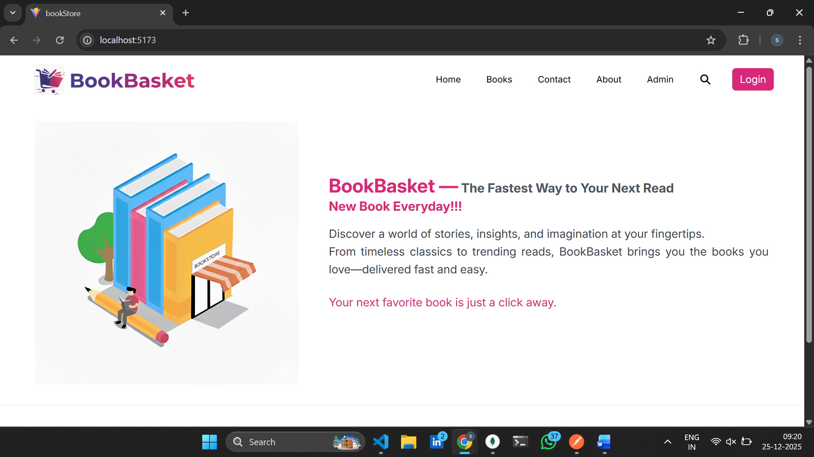
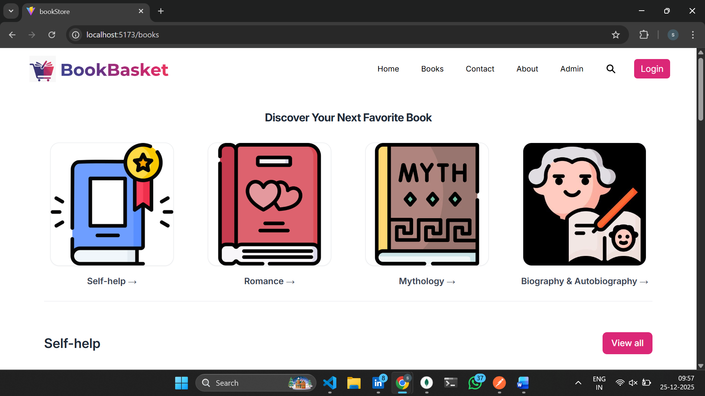
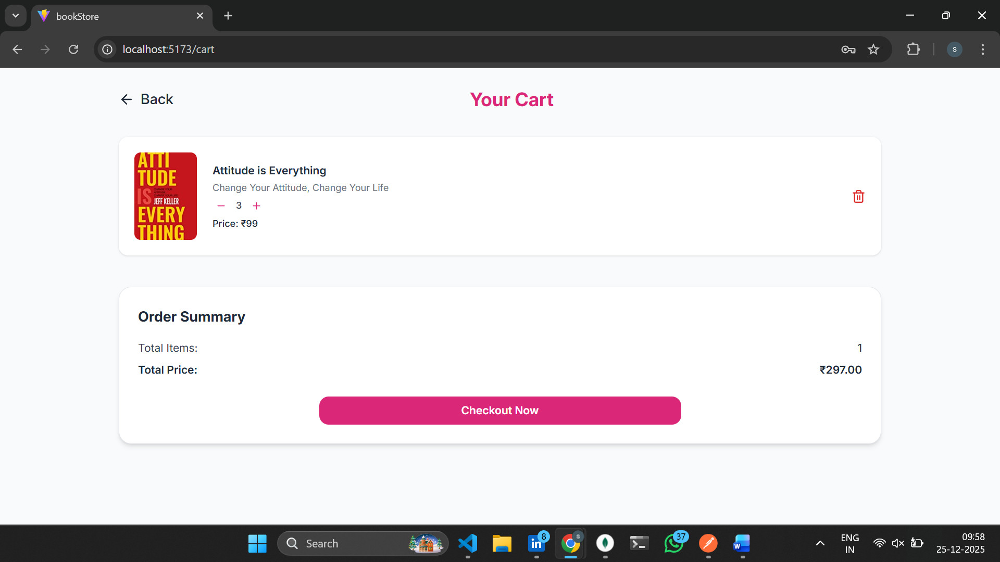
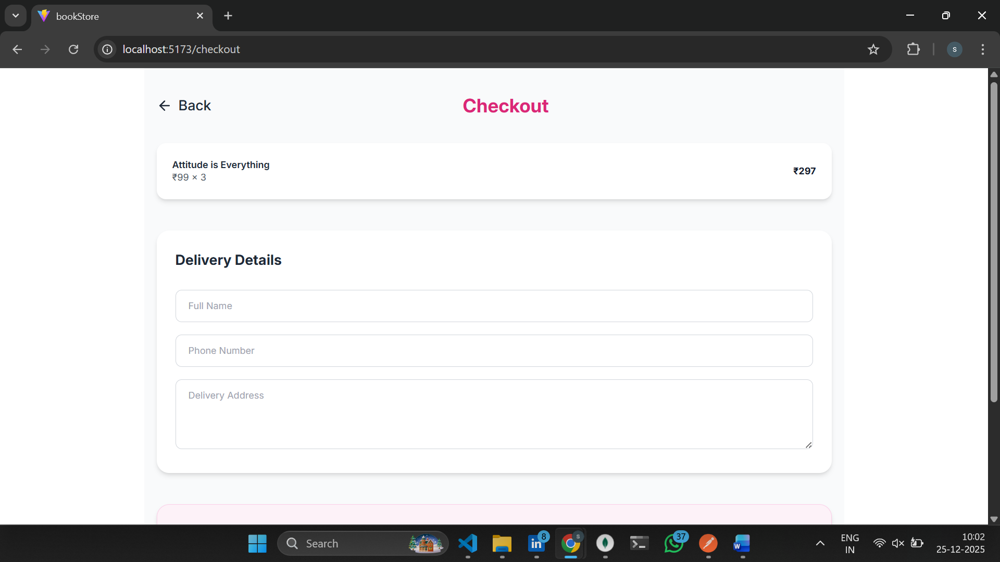
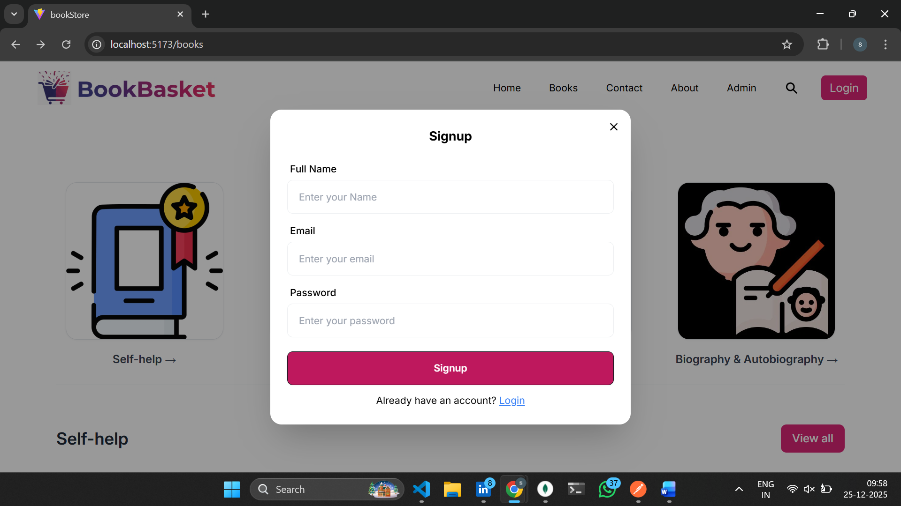
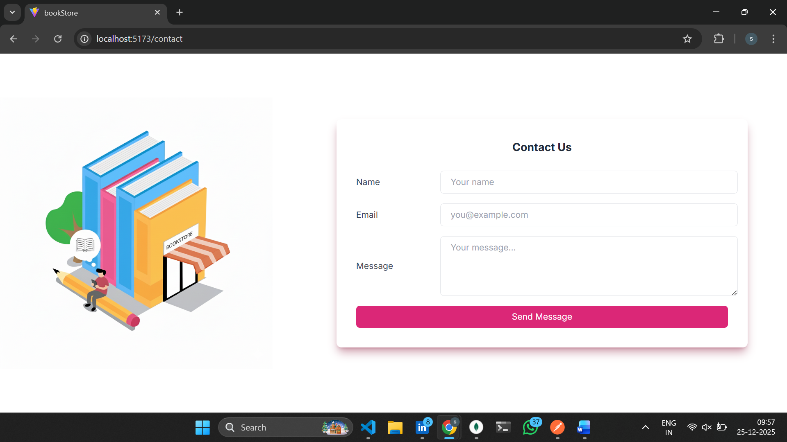
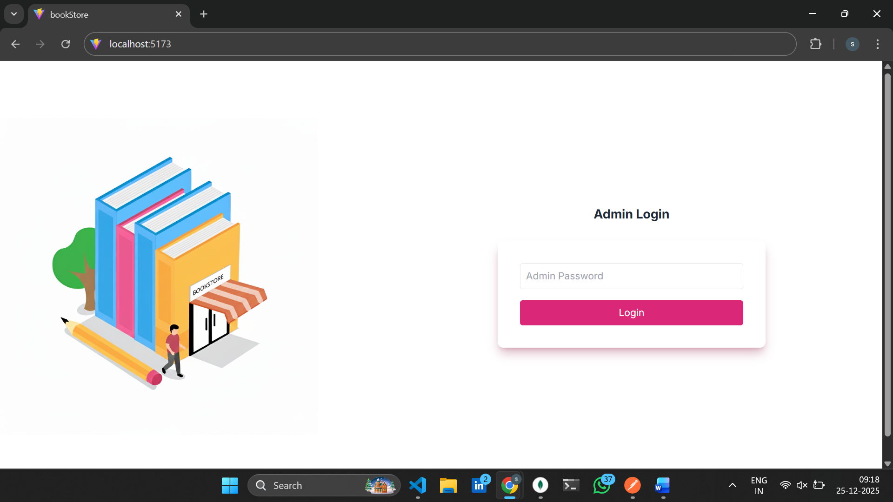
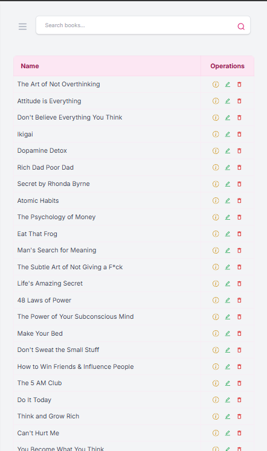
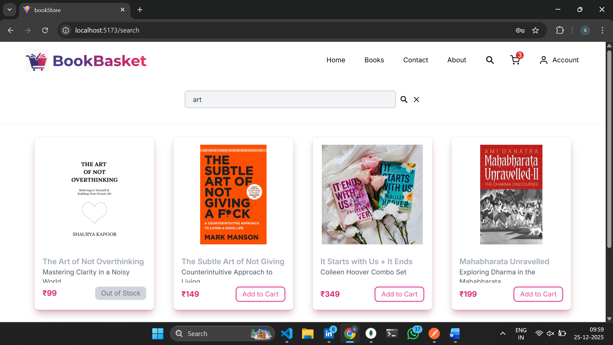
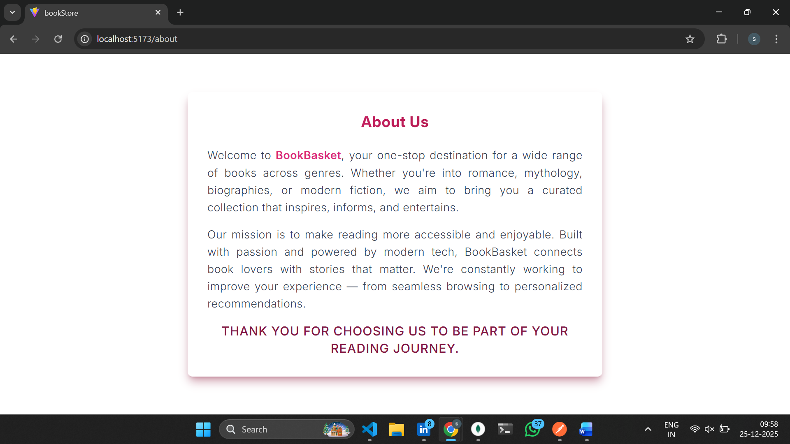

# MERN Bookstore Application

## Quick Summary 
A full-stack MERN Bookstore application featuring user authentication, book browsing, cart management, checkout flow, past orders, and an admin dashboard for managing books and orders. Built with React, Node.js, Express, and MongoDB following clean UI and RESTful API practices.

-------------------------

## Project Overview
This project is a complete online bookstore platform where users can explore books, add them to a cart, place orders, and track their order history. Admin users can manage books, view orders, and control order statuses. The application is designed with scalability and real-world e-commerce flow in mind.

-------------------------

### Features
#### User Features
- User authentication (login & signup)
- Browse books by category
- Add / remove books from cart
- Increase or decrease quantity
- Secure checkout flow
- View past orders
- Responsive UI

#### Admin Features
- Admin login
- View all orders
- Update order status (Pending → Shipped → Delivered)
- Automatic stock reduction on delivery
- Manage books inventory

-------------------------

### Tech Stack
#### Frontend
- React (Vite)
- Redux Toolkit
- React Router DOM
- Tailwind CSS + DaisyUI
- Axios
- React Hot Toast / Toastify
- Lucide & React Icons

#### Backend
- Node.js
- Express.js
- MongoDB & Mongoose
- dotenv
- CORS

-------------------------

### Project Structure
```
bookStoreApp/
├── backend/
│ ├── route/
│ ├── model/
│ ├── controller/
│ ├── index.js
│ ├── .env
│ └── package.json
│
├── frontend/
│ ├── public/
│ ├── src/
│ ├── components/
│ ├── index.html
│ └── package.json
│
├── package.json
└── README.md
```
-------------------------

### Installation & Setup

#### 1. Clone the repository
```
git clone http://github.com/Sudheeksha-Herle-V/BookStore-App.git
cd bookStoreApp
```

#### 2. Backend Setup
```
cd backend
npm install
npm start
```

#### 3. Create a .env file and add
```
MongoDBURI=your_mongodb_connection_string
PORT=4000
```

#### 4. Frontend Setup
```
cd frontend
npm install
npm run dev
```

#### 5. Admin authentication 
```
It is handled via backend validation.  
(Admin credentials are intentionally not exposed in README for security reasons.)
```

#### 6. Future Improvements

•	Role-based authentication using JWT
•	Payment gateway integration
•	Wishlist feature
•	Product reviews & ratings
•	Improved admin analytics dashboard

-------------------------

### API is tested through **POSTMAN**

#### Admin Endpoints
GET ADMIN LOGIN

#### Books Endpoints
GET BOOK
POST BOOK
DELETE BOOK

#### Contact Endpoints
GET CONTACT
DELETE CONTACT

#### User Endpoints
GET USER
DELETE USER

#### Cart Endpoints
GET CART
POST CART
DELETE ITEM
DELETE ALL

#### Order Endpoints
GET ORDER
GET ORDER ADMIN
POST CHECKOUT

------------------------

### App Screenshots

#### Home


#### Books


#### Cart


#### Checkout


#### Login


#### Sign-up


#### Contact


#### Admin Login


#### Admin Dashboard


#### Mobile Admin Dashboard


#### Search


#### About



### AUTHOR
**Sudheeksha Herle V**  
GitHub: *https://github.com/Sudheeksha-Herle-V*  
LinkedIn: *https://linkedin.com/in/sudheeksha-herle-v*


